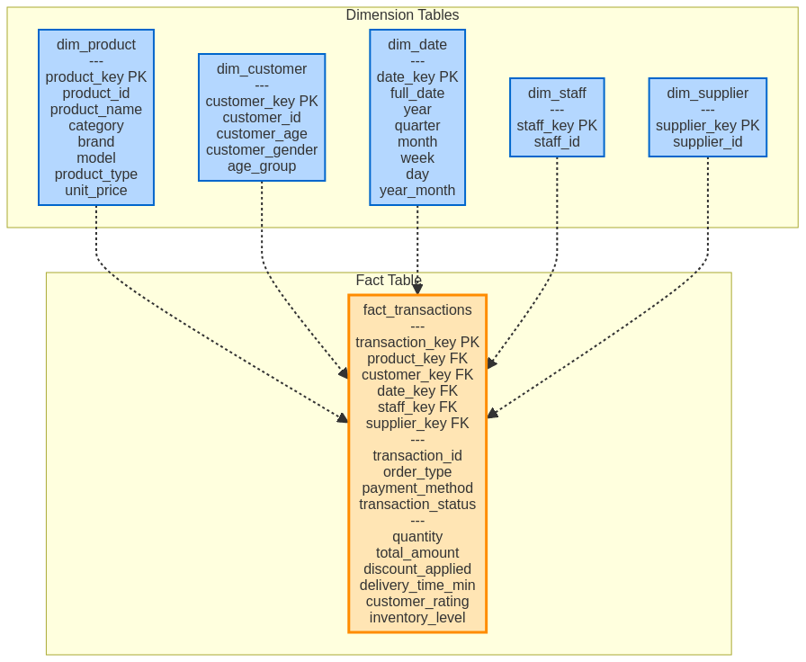

## Executive Summary

This document provides comprehensive documentation for a complete data analytics solution designed for a mobile phone repair and accessories shop. The project implements industry best practices for data warehousing, ETL processes, and business intelligence visualization.

The solution architecture consists of four main components: a 
**FastAPI data source**
**Python ETL pipeline**
**star schema data warehouse** in SQLite
**interactive Dash dashboard** for business intelligence reporting.
---

## 1. Project Architecture

### 1.1 System Overview

The project follows a modern data analytics architecture with clear separation of concerns across four layers:

1. **Data Source Layer:** FastAPI application serving transaction data via RESTful endpoints
2. **ETL Layer:** Python-based extraction, transformation, and loading pipeline
3. **Data Warehouse Layer:** SQLite database with star schema design
4. **Presentation Layer:** Interactive Dash/Plotly dashboard for data visualization

### 1.2 Data Flow

The data flows through the system in the following sequence:

```
CSV File → FastAPI → ETL Script → SQLite Data Warehouse → Dashboard
```

Each component is designed to be modular and can be replaced or upgraded independently without affecting the entire system.

---

## 2. Star Schema Design

### 2.1 What is a Star Schema?

A **star schema** is a dimensional modeling approach widely used in data warehousing for analytical workloads. It consists of a central **fact table** surrounded by multiple **dimension tables**, resembling a star when visualized.

### 2.2 Benefits of Star Schema

The star schema provides several advantages for business intelligence applications:

- **Simplified Queries:** Denormalized structure reduces the number of joins required
- **Optimized Performance:** Pre-aggregated data and indexed dimensions enable fast query execution
- **Intuitive Design:** Business users can easily understand the relationships between facts and dimensions
- **Scalability:** New dimensions can be added without restructuring existing tables
- **BI Tool Compatibility:** Most BI tools are optimized for star schema structures

### 2.3 Schema Diagram



### 2.4 Table Descriptions

#### Fact Table: `fact_transactions`

The central fact table stores all transactional events with numeric measures and foreign keys to dimension tables.

**Key Columns:**
- **Foreign Keys:** `product_key`, `customer_key`, `date_key`, `staff_key`, `supplier_key`
- **Degenerate Dimensions:** `transaction_id`, `order_type`, `payment_method`, `transaction_status`
- **Measures:** `quantity`, `total_amount`, `discount_applied`, `delivery_time_min`, `customer_rating`, `inventory_level`

#### Dimension Tables

**`dim_product`**
- Stores product attributes including category, brand, model, and product type
- Enables analysis by product characteristics
- **Grain:** One row per unique product

**`dim_customer`**
- Contains customer demographic information
- Includes derived attribute `age_group` for segmentation
- **Grain:** One row per unique customer

**`dim_date`**
- Complete calendar dimension with hierarchical time attributes
- Supports time-based analysis at various granularities (year, quarter, month, week, day)
- **Grain:** One row per calendar date

**`dim_staff`**
- Stores staff member identifiers
- Can be extended with additional staff attributes
- **Grain:** One row per staff member

**`dim_supplier`**
- Contains supplier information
- Enables supplier performance analysis
- **Grain:** One row per supplier

---

## 3. ETL Process

### 3.1 Extract Phase

The extraction phase retrieves data from the FastAPI endpoint using HTTP GET requests. The API returns data in JSON format, which is then converted into a pandas DataFrame for processing.

**Key Features:**
- Error handling for connection failures
- Automatic retry logic (can be implemented)
- Data validation at the source

### 3.2 Transform Phase

The transformation phase applies business logic and data quality rules:

**Transformations Applied:**
1. **Data Type Conversion:** Convert `Transaction_DateTime` to proper datetime objects
2. **Feature Engineering:** Create `Age_Group` by binning customer ages into meaningful segments
3. **Date Decomposition:** Extract year, month, day, and other time components
4. **Data Cleaning:** Handle missing values and outliers (if any)

### 3.3 Load Phase

The load phase populates the data warehouse in a specific sequence:

**Loading Sequence:**
1. **Dimension Tables First:** Populate all dimension tables to generate surrogate keys
2. **Fact Table Second:** Load fact table with foreign key references to dimensions
3. **Aggregate Tables Third:** Create pre-aggregated summary tables for dashboard performance
4. **Indexes Last:** Create indexes after data loading for optimal performance

### 3.4 Performance Optimization

The ETL process includes several optimizations:

- **Batch Processing:** Load data in bulk using pandas `to_sql()` method
- **Index Creation:** Create indexes after data loading to avoid overhead during inserts
- **Pre-Aggregation:** Generate summary tables during ETL to reduce dashboard query time
- **Transaction Management:** Use database transactions to ensure data consistency

---

## 4. Data Warehouse Components

### 4.1 Aggregate Tables

Pre-aggregated tables significantly improve dashboard performance by eliminating the need for complex joins and aggregations at query time.

**`agg_kpi_revenue_by_dimension`**
- Stores total revenue by category, brand, and model
- Supports KPI analysis without joining fact and dimension tables

**`agg_kpi_status_by_order_type`**
- Summarizes transaction status distribution by sales channel
- Enables quick status monitoring

**`agg_customer_metrics`**
- Contains customer-level metrics aggregated by demographics and time
- Supports customer segmentation and trend analysis

**`agg_product_type_distribution`**
- Stores product type distribution across various dimensions
- Enables product mix analysis

### 4.2 Views

SQL views provide convenient access to commonly used data combinations:

**`vw_transaction_details`**
- Joins all dimension tables with the fact table
- Provides a complete, denormalized view of each transaction
- Useful for detailed transaction analysis and reporting

**`vw_monthly_revenue`**
- Aggregates revenue by month
- Includes transaction counts and average transaction values
- Supports time series analysis

**`vw_product_performance`**
- Summarizes product-level metrics
- Includes revenue, quantity sold, and average ratings
- Enables product performance comparison

**`vw_customer_segmentation`**
- Groups customers by demographics
- Calculates segment-level metrics
- Supports customer analytics and targeting

---

## 5. BI Dashboard Features

### 5.1 Dashboard Architecture

The dashboard is built using **Dash**, a Python framework for building analytical web applications. It uses **Plotly** for interactive visualizations.

**Key Technologies:**
- **Dash:** Web application framework
- **Plotly:** Interactive charting library
- **SQLite:** Data source via SQL queries
- **Pandas:** Data manipulation

### 5.2 Tab 1: KPI Analysis

This tab focuses on key performance indicators related to revenue and transaction status.

**Visualizations:**

1. **Total Revenue by Category**
   - **Chart Type:** Bar Chart
   - **Purpose:** Identify which product categories generate the most revenue
   - **Business Value:** Helps prioritize inventory and marketing efforts

2. **Total Revenue by Brand**
   - **Chart Type:** Bar Chart
   - **Purpose:** Compare brand performance
   - **Business Value:** Informs brand partnership and stocking decisions

3. **Top 10 Models by Revenue**
   - **Chart Type:** Horizontal Bar Chart
   - **Purpose:** Highlight the most profitable product models
   - **Business Value:** Guides product focus and promotional strategies

4. **Transaction Status by Order Type**
   - **Chart Type:** Grouped Bar Chart
   - **Purpose:** Monitor completion, cancellation, and refund rates by channel
   - **Business Value:** Identifies operational issues and channel performance

### 5.3 Tab 2: Customer Insights

This tab provides deep insights into customer behavior and demographics.

**Visualizations:**

1. **Average Discount by Customer Demographics**
   - **Chart Type:** Grouped Bar Chart
   - **Purpose:** Analyze discount patterns across age groups and genders
   - **Business Value:** Optimizes promotional strategies and pricing

2. **Average Customer Rating by Demographics**
   - **Chart Type:** Grouped Bar Chart
   - **Purpose:** Identify customer satisfaction levels by segment
   - **Business Value:** Highlights areas for service improvement

3. **Transaction Trends Over Time**
   - **Chart Type:** Line Chart
   - **Purpose:** Track transaction volume changes over months
   - **Business Value:** Reveals seasonal patterns and growth trends

4. **Total Revenue by Customer Segment**
   - **Chart Type:** Heatmap
   - **Purpose:** Visualize revenue contribution by age group and gender
   - **Business Value:** Identifies high-value customer segments

### 5.4 Tab 3: Product Deep-Dive

This tab analyzes product mix and type distribution.

**Visualizations:**

1. **Product Type Distribution by Category**
   - **Chart Type:** Stacked Bar Chart
   - **Purpose:** Show the split between accessories and repairs for each category
   - **Business Value:** Informs inventory balance decisions

2. **Product Type Distribution by Brand**
   - **Chart Type:** Stacked Bar Chart
   - **Purpose:** Analyze product type mix across brands
   - **Business Value:** Guides brand-specific strategies

3. **Top 10 Models by Transaction Count**
   - **Chart Type:** Stacked Horizontal Bar Chart
   - **Purpose:** Identify the most frequently sold models
   - **Business Value:** Highlights popular products for stock optimization

4. **Top 10 Products by Transaction Count**
   - **Chart Type:** Stacked Horizontal Bar Chart
   - **Purpose:** Show the most popular individual products
   - **Business Value:** Enables focused marketing and inventory management

---

## 6. Implementation Guide

### 6.1 Prerequisites

- Python 3.10 or higher
- pip package manager
- Terminal or command prompt access

### 6.2 Installation Steps

**Step 1: Install Dependencies**
```bash
pip install -r requirements.txt
```

**Step 2: Initialize the Database Schema (Optional)**
```bash
sqlite3 mobile_shop_dw.db < schema.sql
```

### 6.3 Execution Sequence

**Terminal 1: Start the API**
```bash
python api.py
```
- API will run on `http://127.0.0.1:8000`
- Keep this terminal open

**Terminal 2: Run the ETL Pipeline**
```bash
python etl_star_schema.py
```
- This creates and populates the data warehouse
- Run once or whenever data needs to be refreshed

**Terminal 3: Launch the Dashboard**
```bash
python dashboard.py
```
- Dashboard will be available at `http://127.0.0.1:8050`
- Open in a web browser

---

## 7. Business Intelligence Insights

### 7.1 KPI Analysis Insights

Based on the data warehouse structure, the following KPIs can be analyzed:

- **Revenue Performance:** Total revenue by category, brand, and model
- **Transaction Metrics:** Transaction counts, completion rates, and average transaction values
- **Channel Performance:** Revenue and transaction status by order type (Walk-In, Shopee, Lazada)
- **Operational Efficiency:** Delivery times, inventory levels, and staff performance

### 7.2 Customer Analysis Insights

The customer dimension enables segmentation and behavioral analysis:

- **Demographic Segmentation:** Revenue and transaction patterns by age group and gender
- **Customer Satisfaction:** Rating analysis by customer segment
- **Discount Effectiveness:** Discount application patterns and their impact on sales
- **Temporal Patterns:** Transaction trends over time by customer segment

### 7.3 Product Analysis Insights

The product dimension supports detailed product performance analysis:

- **Product Mix:** Distribution of accessories vs. repairs
- **Brand Performance:** Revenue and transaction counts by brand
- **Category Analysis:** Performance comparison across product categories
- **Model Popularity:** Identification of top-selling models

---

## 8. Data Quality and Governance

### 8.1 Data Quality Measures

The ETL process implements several data quality checks:

- **Data Type Validation:** Ensures all fields have correct data types
- **Referential Integrity:** Foreign key constraints maintain relationships
- **Completeness Checks:** Validates that required fields are populated
- **Consistency Rules:** Ensures data consistency across tables

### 8.2 Data Lineage

The data lineage is clearly documented:

1. **Source:** `mobile_shop_transactions_3years.csv`
2. **API Layer:** FastAPI endpoint
3. **ETL Processing:** `etl_star_schema.py`
4. **Data Warehouse:** `mobile_shop_dw.db`
5. **Consumption:** Dash dashboard

---

## 9. Future Enhancements

### 9.1 Technical Enhancements

- **Incremental ETL:** Implement delta loading instead of full refresh
- **Data Validation:** Add comprehensive data quality checks
- **Error Logging:** Implement detailed logging and error tracking
- **Performance Monitoring:** Add query performance metrics
- **Automated Scheduling:** Use cron jobs or task schedulers for automated ETL runs

### 9.2 Analytics Enhancements

- **Predictive Analytics:** Implement forecasting models for sales and inventory
- **Customer Lifetime Value:** Calculate CLV for customer segmentation
- **Market Basket Analysis:** Identify product purchase patterns
- **Anomaly Detection:** Detect unusual patterns in transactions
- **Real-time Dashboards:** Implement streaming data processing

### 9.3 Infrastructure Enhancements

- **Containerization:** Package the application using Docker
- **Cloud Deployment:** Deploy to cloud platforms (AWS, Azure, GCP)
- **Database Migration:** Consider PostgreSQL or other RDBMS for production
- **API Authentication:** Add security layers to the API
- **Dashboard Authentication:** Implement user login and role-based access

---

## 10. Conclusion

This project demonstrates a complete, production-ready data analytics solution using modern tools and best practices. The star schema design ensures optimal query performance, the ETL pipeline provides reliable data integration, and the interactive dashboard delivers actionable business insights.

The modular architecture allows for easy maintenance, scalability, and future enhancements. Whether used for learning purposes or as a foundation for a production system, this project provides a solid framework for data-driven decision making in a retail environment.

---

## Appendix A: File Descriptions

| File Name | Description |
|-----------|-------------|
| `api.py` | FastAPI application serving transaction data |
| `etl_star_schema.py` | ETL script for populating the star schema |
| `schema.sql` | SQL DDL script for creating the database schema |
| `dashboard.py` | Dash application for BI visualizations |
| `mobile_shop_transactions_3years.csv` | Source data file (3 years of transactions) |
| `mobile_shop_dw.db` | SQLite data warehouse (generated by ETL) |
| `requirements.txt` | Python package dependencies |
| `README.md` | Quick start guide |
| `PROJECT_DOCUMENTATION.md` | This comprehensive documentation |

---

## Appendix B: SQL Query Examples

**Example 1: Total Revenue by Category**
```sql
SELECT dimension_value AS category, total_amount
FROM agg_kpi_revenue_by_dimension
WHERE dimension = 'Category'
ORDER BY total_amount DESC;
```

**Example 2: Customer Segmentation**
```sql
SELECT age_group, gender, 
       SUM(transaction_count) AS total_transactions,
       AVG(avg_customer_rating) AS avg_rating
FROM agg_customer_metrics
GROUP BY age_group, gender
ORDER BY total_transactions DESC;
```

**Example 3: Monthly Revenue Trend**
```sql
SELECT year_month, 
       SUM(transaction_count) AS transactions,
       SUM(total_revenue) AS revenue
FROM agg_customer_metrics
GROUP BY year_month
ORDER BY year_month;
```

---

**End of Documentation**

